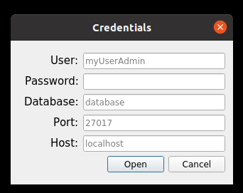
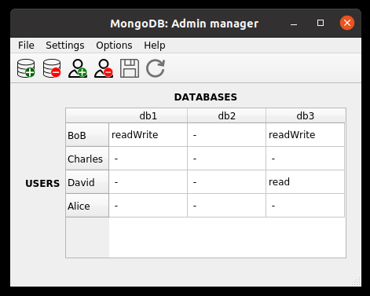
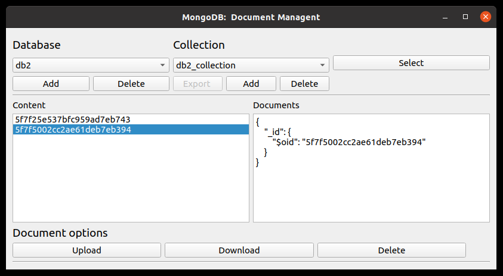

## MongoDB manager
This program provides an interface for managing the users and databases in MongoDB. It can be done either via command line or using the GUI. 

## Installation
First we have to install MongoDB:
* [Installing MongoDB Community Edition on Ubuntu](https://docs.mongodb.com/manual/tutorial/install-mongodb-on-ubuntu/)

Second, we have to install the c++ driver in order to be able to access and manage our mongodb service:

* [Installing the MongoDB C Driver (libmongoc) and BSON library (libbson)](http://mongoc.org/libmongoc/current/installing.html)

* [Installing the mongocxx driver](http://mongocxx.org/mongocxx-v3/installation/)

Make sure that the installed libraries are linked:
```sh
sudo ldconfig
```
The last stem consists on enabling the administrator rights:

* [Enable Access Control](https://docs.mongodb.com/manual/tutorial/enable-authentication/)


## Usage
Start the MongoDB service:
```sh
$  sudo mongod --auth --port 27017 --dbpath /var/lib/mongodb
```

When using the command line, it is necessary to provide the path to the credentials file. 

```sh
$ cd bin
$ ./MongoDB_admin -c ../src/shared/credentials.json
```

This file contains the necessary credentials for accessing MongoDB as admin:

```json
{
    "database": "admin",
    "host": "localhost",
    "password": "123456",
    "port": "27017",
    "user": "myUserAdmin"
}
```

The output will show a table with the current databases, users and roles

``` 
INFO: MongoDB management table:
          db1         db2    db3         
Alice      -          read    - 
BoB       readWrite    -     readWrite
Charles    -           -      - 
David      -           -     read
```

In addition, the information will be saved into a **.csv** file at : 
* **/src/shared/UsersAndRoles.csv**


In order to apply any modification, it is necessary to provide all the parameters required for each action: 


```sh
$ sudo ./MongoDB_admin -c ../src/shared/credentials.json  -u Alice -a deleteUser

INFO: MongoDB management table:
          db1         db2   db3         
BoB       readWrite    -    readWrite
Charles    -           -     - 
David      -           -    read
"INFO: Deleting user: Alice"
```

In order to run the GUI version:

```sh
$  sudo ./MongoDB_admin -gui
```

If the credentials file doesn't exist, the following window will pop up asking for the authorization parameters:

<p align="center">
    
  </a>
</p>

If the credentials are correct, the JSON file will be created and stored at:

* **/src/shared/credentials.csv**

Once the athentication is completed and we have access to the MongoDB databases the following window will appear. 

<p align="center">
    
  </a>
</p>

On the toolbar we can add/remove users and databases. When clicking in a specific cell, the list of possible roles will appear and we can select the desired role for an specific user and database.

By clicking in Options->Documents, we can acces the following screen:

<p align="center">
    
  </a>
</p>

This section allows for management of collections and documents in the databases.